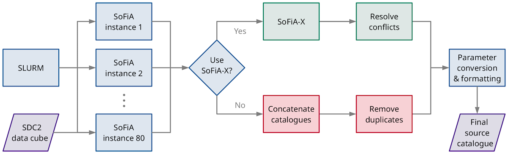

# SKA SDC2 Team “SoFiA”

[](https://github.com/axshen/SKA-SDC2-SoFiA/actions/workflows/linter.yml)

## Overview

This reporsitory contains information, scripts and setup files in relation to the participation of team “SoFiA” in the [SKA Science Data Challenge 2](https://sdc2.astronomers.skatelescope.org/) (SDC2) which closed on 31 July 2021. Our team used the

* **Source Finding Application** ([SoFiA](https://github.com/SoFiA-Admin/SoFiA-2/)),

more specifically development version 2.3.1, dated 22 July 2021, which is available for [download from GitHub](https://github.com/SoFiA-Admin/SoFiA-2/tree/11ff5fb01a8e3061a79d47b1ec3d353c429adf33). The purpose of this repository is to provide a copy of the SoFiA setup files used in the SDC2 in addition to a couple of Python scripts that our team used for postprocessing of the SoFiA output.


## Prerequisites

The following **software** packages are required for reproducing the source catalogue created by our team:

* [SoFiA v2.3.1](https://github.com/SoFiA-Admin/SoFiA-2/tree/11ff5fb01a8e3061a79d47b1ec3d353c429adf33)
* [TOPCAT v4.7](http://www.star.bris.ac.uk/~mbt/topcat/)
* [Python v3.8.2](https://www.python.org/)
* [NumPy v1.17.4](https://numpy.org/)
* [Astropy v4.0](https://www.astropy.org/)

Software versions other than the ones listed here may work as well, but have not been tested. Each of these software packages may have their own dependencies; we refer to the installation instructions of the respective package for details.

In addition, access to an **HPC environment** with adequate resources and availability of the **Slurm workload manager** is required. For maximal speed, **80 compute nodes**, each with 27 GB of RAM and 8 parallel threads, would be required. However, SoFiA can be run without any problem on systems with fewer nodes/threads, although execution of the pipeline would take longer in this case.


## FLowchart

The following flowchart illustrates the individual steps taken by our team to run the source finder and convert the output into a single source catalogue that can be uploaded to the SDC2 scoring service. The individual steps are explained in the following sections of this document.




## Running SoFiA

All of the configuration files required to run SoFiA on the full SDC2 data cube are located in the `sofia` folder. In order to launch the SoFiA run, all files contained in the folder `sofia` must be copied into the directory where the SDC2 data cube (`sky_full_v2.fits`) is located. It is further assumed that SoFiA is installed and can be launched with the command `sofia`. SoFiA can then be executed by simply running the

```
run_sofia.sh
```

shell script. This will use Slurm to create **80 batch jobs**, each of which is running on a smaller region of the data cube of about 11.8 GB in size. Depending on the specifications of the HPC cluster and available resources, this could take several hours to complete. Once all instances are finished, the output catalogues and image products from each run should have been written into the same directory. The `output.directory` setting in the individual SoFiA parameter files can be modified to define a different output directory if desired.


## Post-processing

Once the SoFiA run is complete, several post-processing steps will be required to turn the 80 output catalogues from the individual instances into a single catalogue listing the specific source parameters required by the SDC2 scoring service. Two alternative options are available for merging the catalogues:

1. SoFiA-X
2. Python + TOPCAT

### Alternative 1: Merging Catalogues With SoFiA-X

SoFiA-X is a wrapper around SoFiA 2 that can be used to upload the output files from parallel runs of SoFiA 2 into an online database. Duplicate detections in regions of overlap between individual instances will be automatically resolved, with the additional option of manual resolution in cases where the automatic resolution algorithm encounters a conflict.

SoFiA-X is publicly available for download from [GitHub](https://github.com/AusSRC/SoFiAX). Additional information on how to install and use the software is available in the README file in the SoFiA-X GitHub repository. As setting up SoFiA-X is non-trivial, we will refrain from providing further information here and instead refer the reader to the SoFiA-X repository for further instructions.

### Alternative 2: Merging Catalogues With Python + TOPCAT

Another option of merging the output catalogues from the individual SoFiA instances is to use a combination of Python scripts and functionality provided by [TOPCAT](http://www.star.bris.ac.uk/~mbt/topcat/). This does not require the use of SoFiA-X and may therefore be the preferred method for most users. A Python script for **concatenating** the individual output catalogue files is available in `scripts/concatenate_catalogues.py`. This script can simply be copied into the same directory where the indivual output catalogues are located and then be launched via

```
python concatenate_catalogues.py
```

to concatenate all 80 catalogues into a single output catalogue named `merged_catalogue.xml`. The merged catalogue can be loaded into TOPCAT to remove any potential **duplicate detections** from regions of overlap between individual instances.

```
topcat merged_catalogue.xml
```

Once loaded, the first step will be to discard all detections that are **cut off** at the spatial or spectral boundary of a region by retaining only those detections with a quality flag value of 0. This can be achieved by creating a new **row subset** in TOPCAT with the following settings:

* Subset Name: `clean`
* Expression: `flag < 1`

Next, we need to select the new subset in the TOPCAT **main window** by setting:

* Row Subset: `clean`

The remaining sources can then be cross-matched using TOPCAT’s **Internal Match** algorithm with the following settings:

* Algorithm: Sky + X
* Max Error: `10.5` (arcsec)
* Error in X: `1.2e+6`
* Table: `merged_catalogue.xml`
* RA column: `ra` (degrees)
* Dec column: `dec` (degrees)
* X column: `freq`
* Action: Eliminate All But First of Each Group

This should create a new table named `match(1)` with all duplicate detections removed. Duplicates are here defined as detections that are located within 10.5 arcsec (~1.5 beam sizes) and 1.2 MHz (~380 km/s at redshift 0.5) of each other. The new table can now be **saved** again in **VOTable format** under a new name, for example `merged_catalogue_clean.xml`.

### Parameter Conversion

In the last step, the merged SoFiA 2 output catalogue must be **converted** into the format expected by the **SDC2 scoring service**. For this purpose, several source parameters will need to be converted from observational to physical units. This can be achieved by running the Python script provided in `scripts/physical_parameter_conversion.py`. Information on the different command-line options supported by the script can be found in the header of the source file. In addition to parameter conversion, the script will also apply statistical **noise bias corrections** for several parameters (flux, line width and disc size) which were derived from the 40 GB development data cube. For the final catalogue uploaded to the SDC2 scoring service, the following settings were used:

```
python physical_parameter_conversion.py merged_catalogue_clean.xml 0.1 0.0 700 > sdc2_catalogue.dat
```

This will produce a **final catalogue** containing the parameters to be supplied to the SDC2 in the format required by the scoring service. This final catalogue can then be uploaded to the **scoring service** using the standard command `sdc2-score create sdc2_catalogue.dat` (assuming that the [SDC2 scoring service scripts](https://pypi.org/project/ska-sdc2-scoring-utils/) are installed and set up correctly).


## Resources

* [SKA Science Data Challenge 2](https://sdc2.astronomers.skatelescope.org/)
* [SDC2 scoring service utilities](https://pypi.org/project/ska-sdc2-scoring-utils/)
* [SoFiA 2](https://github.com/SoFiA-Admin/SoFiA-2/)
* [SoFiA-X](https://github.com/AusSRC/SoFiAX)
* [TOPCAT](http://www.star.bris.ac.uk/~mbt/topcat/)


## Team Members

The following people have contributed to the SDC2 team “SoFiA”:

* [Tobias Westmeier](http://www.atnf.csiro.au/people/Tobias.Westmeier/) (chair)
* [Kelley Hess](https://twitter.com/khesser)
* [Thijs van der Hulst](https://www.astro.rug.nl/~vdhulst/)
* [Russell Jurek](https://smp.uq.edu.au/profile/2287/russell-jurek)
* [Slava Kitaeff](https://research-repository.uwa.edu.au/en/persons/slava-kitaeff)
* [Dave Pallot](https://www.icrar.org/people/dpallot/)
* [Paolo Serra](http://www.oa-cagliari.inaf.it/staff.php?id_person=115)
* [Austin Shen](https://www.axshen.com/)


## Acknowledgements

We acknowledge support from the [Australian SKA Regional Centre](https://aussrc.org/) (AusSRC) and the [Pawsey Supercomputing Centre](https://pawsey.org.au/) in Perth, Western Australia.


## Copyright and licence

Copyright (C) 2021 Team “SoFiA”

This program is free software: you can redistribute it and/or modify it under the terms of the GNU General Public License as published by the Free Software Foundation, either version 3 of the License, or (at your option) any later version.

This program is distributed in the hope that it will be useful, but WITHOUT ANY WARRANTY; without even the implied warranty of MERCHANTABILITY or FITNESS FOR A PARTICULAR PURPOSE. See the GNU General Public License for more details.

You should have received a copy of the GNU General Public License  along with this program. If not, see http://www.gnu.org/licenses/.
